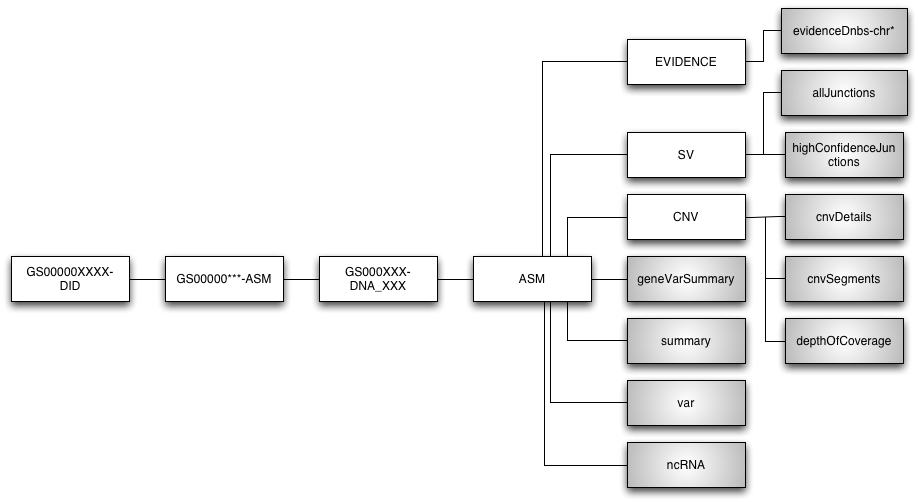

.. Complete Genomics Tools documentation master file, created by
   sphinx-quickstart on Sun Jan  9 14:42:45 2011.
   You can adapt this file completely to your liking, but it should at least
   contain the root `toctree` directive.

.. toctree::
   :hidden:

   
   cgatools

.. index:: somatic2annovar, cgatools, annovar, summarize_annovar.pl, SomaticScore, Circos, mastervar, BAM, SAM, IGV, generatemastervar, evidence2sam

Introduction to Complete Genomics Data
===================================================

`Complete Genomics <http://completegenomics.com>`_ is a sequencing company that offers human whole-genome sequencing.  They also provide primary data analysis and generally ship a disk with data back to the customer that contains raw data as well as processed data.  While they do provide this service, they do not provide visualization of the data and do not provide multiple-sample analyses such as tumor/normal comparisons or family-based analysis.  This toolset is small and very utilitarian and meant to fill in gaps in what is offered by Complete Genomics.

Complete Genomics Data Overview
-------------------------------
The data distributed by Complete Genomics are described on their website and in numerous documents they hand out to customers.  A high-level view of the directory structure is probably useful to have, though.  Keep in mind that all data from the company are *based on a single sample*.  Comparisons between samples or other multisample datasets need to be derived using Complete Genomics cgatools_ or other scripts.

   This figure shows the Complete Genomics directory structure.  Files (or representative names) are shaded and directories are in white.

Important files of interest are described in the table.

.. csv-table
   :header: "File","Directory","Description"
   :widths: 20, 20, 75

   "summary","ASM","This file is very small (50 lines or so) and gives a very high-level overview of the sequencing, including things like coverage, number of snps and indels, variant classifications, and ti/tv, etc."

Working with cgatools_
======================
Complete Genomics supports a toolset called cgatools_.  This set of tools implements a number of very useful algorithms for single-sample datasets, tumor/normal datasets, and, potentially association-type or family-based datasets.  While not meant to be a complete review of the toolset (see the cgatools_ docs for details), this section is meant to give a couple of examples that are important in all workflows.

Viewing the Data in Genomic Context--Generating BAM Files
---------------------------------------------------------
The reads used to support reference and variant calls that are aligned to the genome are stored in the *ASM/EVIDENCE* directory in files called *evidenceDnbs-chr*.  The file format is tab-separated text and the files are split per chromosome.  The cgatools_ software can convert these reads into `SAM/BAM format`__.  This can be quite useful for verifying variants in a visual and genomic context using tools like the `IGV software <http://www.broadinstitute.org/software/igv/>` or the `UCSC genome browser <http://genome.ucsc.edu>`.

.. _SAMBAM: http://samtools.sourceforge.net/SAM-1.3.pdf

__ SAMBAM_

The actual cgatools_ evidence2sam call looks like:

.. code-block:: bash

   cgatools evidence2sam --beta \
     -e evidenceDnbs-chr1-GS000002012-ASM.tsv.bz2 \
     -s /path/to/build37.crr \
     --add-mate-sequence \
     --add-allele-id \
     -o evidenceDnbs-chr1-GS000002012-ASM.sam

Note that cgatools_ happily reads from compressed files.  From the output SAM format file, one will need to convert to the binary BAM format and then sort the file into chromosome order:

.. code-block:: bash

   samtools import /path/to/build37.fa.fai evidenceDnbs-chr1-GS000002012-ASM.sam \
     evidenceDnbs-chr1-GS000002012-ASM.bam
   samtools sort evidenceDnbs-chr1-GS000002012-ASM.bam evidenceDnbs-chr1-GS000002012-ASM.sorted

One can write a simple *for* loop over the evidenceDnbs-chr* files to generate one BAM file per chromosome.  After doing so, merging into one file will enable typical tools that read the BAM format or a genome browser to operate on the whole genome.

.. code-block:: bash
   
   samtools merge mysample.bam \*.sorted.bam 
   samtools index mysample.bam

Here, *mysample.bam* represents the final BAM file name.  The samtools index command will generate a *mysample.bam.bai* file that will be use for very fast random access to any genomic location of interest.

.. sidebar:: SAM (and BAM) Format

    SAM (Sequence Alignment/Map) format is a generic format for storing large nucleotide sequence alignments. SAM aims to be a format that:

	* Is flexible enough to store all the alignment information generated by various alignment programs;
	* Is simple enough to be easily generated by alignment programs or converted from existing alignment formats;
	* Is compact in file size;
	* Allows most of operations on the alignment to work on a stream without loading the whole alignment into memory;
	* Allows the file to be indexed by genomic position to efficiently retrieve all reads aligning to a locus. 

    SAM Tools provide various utilities for manipulating alignments in the SAM format, including sorting, merging, indexing and generating alignments in a per-position format.

Overview of Variants--Generating a Mastervar File
-------------------------------------------------
Prior to mid-January, 2011, Complete Genomics were using several different files for storing biologically relevant genomic data.  For example, there were files for copy number, exonic variants, and non-exonic variants and annotation was sparse.  Recently, they have begun to ship with a file called a Mastervar format file.  This file is a one-stop-shop for variant data and annotation.  Unfortunately, it does not exist for older data deliveries; fortunately, it is simple to generate it:

.. code-block:: bash

   cgatools generatemastervar --beta --variants=var-GS000002013-ASM.tsv.bz2 \
     --export-root=../ --reference=/data/sedavis/public/CG/build37.crr \
     --annotations=copy,evidence,gene,ncrna,repeat,segdup,cnv \
     --repmask-data=/data/sedavis/public/CG/rmsk37.tsv.gz \
     --segdup-data=/data/sedavis/public/CG/segdup37.tsv.gz \
     --output=GS000002013.mastervar.tsv   

The Complete Genomics Tools Library
===================================
The Complete Genomics Tools software library is a simple set of tools meant to augment the tools already available from Complete Genomics.  As such, an understanding of what cgatools_ does and the file formats and information content are assumed.  In addition, the visualization pieces rely on the Circos_ library being installed.  *This library assumes that these tools have been installed*:

* cgatools_

* Circos_ 

* annovar_

Installation
------------
After making sure that the libraries noted above are correctly installed, installation of Complete Genomics Tools can be done via two methods.  To install using `pip <http://pypi.python.org/pypi/pip>`_, simply:

::

   % pip install completegenomicstools

If you prefer to work with the source code, the repository is hosted on `GitHub <http://github.com/seandavi/CompleteGenomicsTools/>`_.

Tumor versus Normal Workflow
----------------------------

Calling and Annotating Somatic Variants
^^^^^^^^^^^^^^^^^^^^^^^^^^^^^^^^^^^^^^^
Given two samples, a tumor sample and an normal sample, one often wants to call and annotate somatic variants.  The Complete Genomics cgatools_ offers a tool called :program:`calldiff` that offers that functionality.  The output of that command includes a number of files that describe how the two samples differ in their genotypes.  However, the functional annotation present in the original variant files is, unfortunately, lost in the process.  So, the output from the :program:calldiff must be filtered for biological relevance and then annotated for functional relevance.  A high-level workflow like this:

  1. Apply cgatools_ calldiff to the tumor and normal samples
  2. Filter :program: calldiff output to find variants that differ between the tumor and normal in an interesting way
  3. Annotate the interesting variants in the tumor with functional information using annovar_, specifically the :program:`summarize_annovar.pl` script

An example of the cgatools_ calldiff command looks like:

::

   cgatools calldiff --reference=/data/sedavis/public/CG/build37.crr \
       --variantsA=GS00359-DNA_F01/ASM/var-GS000001738-ASM.tsv.bz2 \
       --variantsB=GS00359-DNA_G01/ASM/var-GS000001739-ASM.tsv.bz2 \
       --reports=SuperlocusOutput,SuperlocusStats,LocusOutput,LocusStats,VariantOutput,SomaticOutput \
       --export-rootA=GS00359-DNA_F01 \
       --export-rootB=GS00359-DNA_G01 \
       --beta

The :program:`calldiff` command takes as input two variant files and two matching "export roots".  The variant files have the name "var-..." and normally live in the export-root/ASM directory.  File *A* is always the tumor while file *B* represents the normal sample.  The export root is the directory directly above the ASM directory.

::

   cgent somatic2annovar SomaticOutput.tsv > somatic.annovar.input

The :program:`somatic2annovar` command simply transforms the calldiff-generated SomaticOutput.tsv file into the appropriate input format for annovar.

::

   summarize_annovar.pl --buildver=hg19 somatic.annovar.input /data/sedavis/public/annovar/hg19/

The :program:`summarize_annovar.pl` script simply runs a standard set of annovar scripts and combines the output into a single text file suitable for filtering in Excel, for example.  The final output, then, of these steps will be a tab-delimited text file containing the variants that are in the tumor but not in the normal.  The last column, the SomaticScore, is a value between 0 and 1, with higher numbers being more likely to be true somatic variants.  However, even numbers as low as 0.1 (or lower) still show a fairly high sensitivity and specificity.  See the cgatools documentation for more details on the calculation and interpretation of the SomaticScore.

.. _cgatools: http://cgatools.sourceforge.net/
.. _Circos: http://mkweb.bcgsc.ca/circos/
.. _annovar: http://www.openbioinformatics.org/annovar/

Using Circos_ to Visualize Data
^^^^^^^^^^^^^^^^^^^^^^^^^^^^^^^
Circos_ is a fantastic tool for visualizing genomic data.  However, setup and file formatting take a bit of work, so the cgent script includes functionality to convert junction files and CGH tracks to a format that can be used directly with Circos_.  

CGH Data
++++++++

Junction Data
+++++++++++++
Complete Genomics provides junction files separately for tumor and normal.  A first step is to "subtract" the junctions in the normal from the tumor:

::
   
   cgatools junctiondiff ....

The command above will generate a junctiondiff file that contains junctions that appear to be present in the tumor but not the normal.  In order to use the junctiondiff output:

::

   cgent junc2circos ....

The cgent junc2circos command will then convert the junctiondiff file into a "link" file to be used by Circos.  The actual construction of the circos plot still needs to be done by hand at this time.

Indices and tables
==================

* :ref:`genindex`
* :ref:`modindex`
* :ref:`search`

